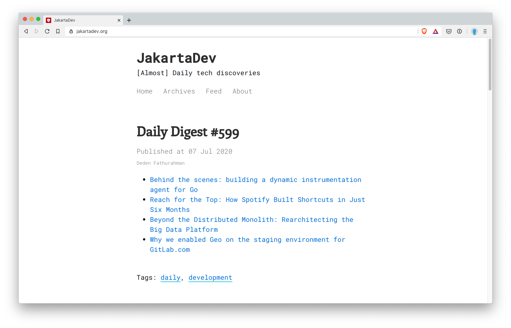

# Jakarta Dev

Jakarta Dev merupakan website yang didedikasikan untuk menginformasikan, atau menyumbangkan, pikiran, berupa tulisan mengenai dunia development, agile, technology, framework, pattern.

Terkadang berisi tautan-tautan (link) ke artikel yang saya ([https://github.com/dedenf](@dedenf)) kurasi sendiri dari banyak website yang saya sering kunjungi hampir setiap hari, juga dari *newsletter* yang saya ikuti.

Mudah-mudah ini menjadi kontribusi yang konsisten di banyaknya website mengenai engineering.

## Acknowledgement

* [pixyll.com](http://www.pixyll.com)
* [BASSCSS](http://basscss.com)
* [Jekyll](http://jekyllrb.com)
* [Refills](http://refills.bourbon.io/)
* [Solarized](http://ethanschoonover.com/solarized)
* [Animate.css](http://daneden.github.io/animate.css/)
* [Netlify](https://netlify.com/)
